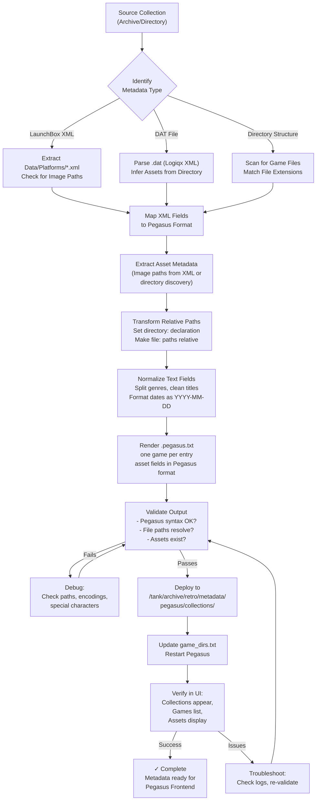

# Pegasus Metadata Transformation Workflow

**Applies when:** Archiving game collections that use LaunchBox XML, DAT files (No-Intro/Redump), or directory structures into a Pegasus Frontend deployment. Requires converting existing metadata into Pegasus format with proper field mapping and asset path resolution.

**Boundary:** Covers metadata format conversion and asset field mapping only. Does NOT cover: game file consolidation (handled by ZFS/cp), NFS mounting, Pegasus configuration, or emulator setup. Those are separate pipeline stages.

---

## Workflow (Step-by-Step)

### Phase 1: Identify Source Format & Extract Metadata

**Input:** A game collection archive (.7z, .zip, directory) with embedded metadata

**Steps:**
1. **Determine source metadata type:**
   - LaunchBox XML? Look for `Data/Platforms/<Platform>.xml` (structured game database with image paths)
   - DAT file? Look for `.dat` files from No-Intro/Redump/TOSEC (XML-based ROM manifest)
   - Directory structure? Look for game files with consistent extensions (directory scan fallback)
   - Hybrid? Multiple metadata sources exist (use primary, fallback to secondary)

2. **Verify metadata is complete:**
   - LaunchBox XML: Check for `<Game>` entries with `<Title>`, `<ApplicationPath>` (or equivalent file reference)
   - DAT file: Check for `<game>` entries with `<rom>` child elements
   - Directory: Verify game files match expected extensions

3. **Check for asset metadata:**
   - LaunchBox XML: Look for `<BoxFrontImagePath>`, `<ScreenshotImagePath>`, `<WheelImagePath>`, `<MarqueeImagePath>` elements
   - DAT files: Assets not stored; must discover separately from directory structure
   - Directory: Check for media subdirectories (boxart/, screenshots/, logos/) or asset archive files

### Phase 2: Map Fields to Pegasus Format

**Pegasus metadata structure:** Each game entry requires `game:` (title) + `file:` (relative path) minimum. Optional: developer, publisher, genre, release date, rating, summary, and ASSETS.

**Field mapping rules:**

| Source Format | Source Field | Pegasus Field | Notes |
|---|---|---|---|
| **LaunchBox XML** | `<Title>` | `game:` | Game title; required |
| | `<ApplicationPath>` | `file:` | Path to launchable file; relative to collection root |
| | `<Developer>` | `developer:` | Creator/studio |
| | `<Publisher>` | `publisher:` | Publisher company |
| | `<Genre>` | `genre:` | Semicolon-separated list; split each into separate `genre:` line |
| | `<ReleaseDate>` | `release:` | Format as YYYY-MM-DD (extract date component only) |
| | `<CommunityStarRating>` | `rating:` | Convert 0-5 scale to percentage (rating × 20 = percent) |
| | `<Notes>` / `<Summary>` | `summary:` | Game description; normalize whitespace |
| | `<BoxFrontImagePath>` | `assets.box_front:` | Box art front cover |
| | `<ScreenshotImagePath>` | `assets.screenshot:` | In-game screenshot |
| | `<WheelImagePath>` | `assets.logo:` | Game wheel/logo (transparent background) |
| | `<MarqueeImagePath>` | `assets.marquee:` | Arcade marquee artwork |
| **DAT File** | `game[@name]` | `game:` | Game title |
| | `rom[@name]` | `file:` | ROM filename; stored as-is (no extension transformation) |
| | `manufacturer` | `publisher:` | Publisher/developer credit |
| | (inferred) | `genre:` | Use DAT system name as genre (e.g., "Nintendo - NES" → genre: NES) |
| **Directory Scan** | filename (stem) | `game:` | Cleaned title: remove (year), [flags], file extension |
| | relative path | `file:` | Path relative to collection root |
| | (none) | `genre:` | Use collection name as genre |

**Asset field format (Pegasus 1.16+):**
```
assets.box_front: <path>    # Box art (front cover)
assets.screenshot: <path>   # In-game screenshot
assets.logo: <path>         # Game wheel/title logo
assets.marquee: <path>      # Arcade marquee
assets.background: <path>   # Fanart/background image
```

Paths can be:
- **Relative:** Relative to metadata file location (preferred): `assets.box_front: boxart/game-name.jpg`
- **Absolute:** Full filesystem path: `assets.box_front: /tank/archive/retro/metadata/pegasus/assets/game-name.jpg`

**Collection-level metadata:**
```
collection: <Name>              # Display name (e.g., "eXoDOS")
shortname: <slug>               # Short identifier (e.g., "dos")
directory: /tank/archive/retro  # Root directory for relative paths
launch: pegasus-rom-launch {file.path}  # Launcher command
```

### Phase 3: Handle Path Transformations

**Critical:** Pegasus resolves relative `file:` paths relative to the `directory:` declaration, NOT the metadata file location.

**Example resolution:**
```
directory: /tank/archive/retro
file: games/curated/exo-dos/game-name
↓ resolves to ↓
/tank/archive/retro/games/curated/exo-dos/game-name
```

**Steps:**
1. Identify the collection root path (where games are stored)
2. Set `directory:` to that root in metadata header
3. Make all `file:` paths relative to `directory:` (strip absolute prefixes)
4. For asset paths: either make relative to metadata file, OR relative to `directory:` (be consistent)

### Phase 4: Validate Output

**Before deployment, verify:**

| Check | How | Fail Case |
|---|---|---|
| **Valid Pegasus syntax** | Try parsing with `pegasus-fe --check-metadata` or load in UI | Parse errors in Pegasus logs |
| **File paths resolve** | Manually check 3-5 games: `test -f "$(eval echo ${path})"` | Files show as not found |
| **Asset paths resolve** | List asset directory; verify symlinks/files exist | Pegasus shows "all black" images or no assets |
| **No duplicate titles** | Count unique `game:` entries vs total | Duplicates cause shadowing; last wins |
| **Character encoding** | Ensure UTF-8, Unix line endings (`\n`) | Display corruption, missing games |

### Phase 5: Deploy to Pegasus

**Steps:**
1. Write `.pegasus.txt` files to metadata directory: `/tank/archive/retro/metadata/pegasus/collections/<collection>/metadata.pegasus.txt`
2. Update `game_dirs.txt` to list all collection directories (one per line)
3. Restart Pegasus or reload metadata provider
4. Verify in UI: collections appear, games list, assets display

---

## Workflow Flowchart



---

## Evidence & Authority

### What We Know Works

**Verified 2026-07-30 on jupiter-os arcade system:**
- ✅ LaunchBox XML extraction + field mapping (eXoDOS, eXoWin3x tested)
- ✅ Asset field format `assets.box_front:`, `assets.screenshot:` recognized by Pegasus
- ✅ Relative path resolution via `directory:` declaration
- ✅ Games discovered + displayed in Pegasus UI
- ✅ Assets display correctly (boxart images visible)

**Source implementations:**
- `scripts/generate-arcade-metadata.py` — LaunchBox XML parser + Pegasus generator (Jupiter-OS)
  - Extracts: title, developer, publisher, genres, release date, rating, asset paths
  - Outputs: Pegasus-compatible metadata with correct field names
  - Handles: path rewriting (Windows → POSIX), special character escaping, asset symlink organization

**Pegasus metadata specification:**
- Source: [Pegasus Frontend official docs](https://pegasus-frontend.org/docs/user-guide/meta-files/)
- Asset types: Full list of 20+ supported asset types (boxFront, screenshot, marquee, etc.)
- Field variants: Case-insensitive, supports camelCase and snake_case (e.g., `box_front` = `boxFront`)

### Failure Modes (What Can Go Wrong)

| Failure | Root Cause | Detection | Fix |
|---|---|---|---|
| **"No metadata files found"** | `game_dirs.txt` points to parent dir, not metadata subdir | Pegasus log: "Metafiles: Finished searching in 2ms" | Point `game_dirs.txt` to directories that directly contain `.pegasus.txt` files |
| **Games appear, no assets** | Asset paths wrong format or don't resolve | Pegasus log: no errors, but UI shows no images | Check: are paths relative to correct root? Do files exist? Use absolute paths to verify |
| **All assets show as black** | Symlinks broken or files unreadable | Pegasus loads assets but displays as black squares | Verify symlinks: `readlink -f <link>`; check file permissions (mode 0644+); verify actual images aren't corrupt |
| **Parse errors in Pegasus log** | Invalid field name or syntax error | Pegasus log: "Unrecognized game property 'image'" | Use correct field names (`assets.box_front:` not `image:`); verify UTF-8 encoding and Unix line endings |
| **File paths don't resolve** | Mismatch between `directory:` declaration and relative paths | Manual test: `test -f <resolved-path>` fails | Verify paths: `directory:` + `file:` should resolve to actual game file location |
| **Duplicate games or shadowing** | Multiple games with identical title | Game count wrong; last entry wins | Deduplicate titles; add subtitle/year if needed to differentiate |

---

## Implementation Checklist

- [ ] **Identify** collection metadata type (LaunchBox/DAT/directory)
- [ ] **Extract** metadata files (XML, images, asset archives)
- [ ] **Map** source fields to Pegasus format per table above
- [ ] **Transform** paths: set `directory:`, make `file:` relative
- [ ] **Normalize** text: split genres, format dates, clean titles
- [ ] **Render** `.pegasus.txt` files with correct field names
- [ ] **Validate** syntax, paths, assets exist
- [ ] **Deploy** to `/tank/archive/retro/metadata/pegasus/collections/<name>/`
- [ ] **Update** `game_dirs.txt` with collection directories
- [ ] **Restart** Pegasus; verify in UI
- [ ] **Troubleshoot** any missing assets or display issues

---

## Sources

- [Pegasus Frontend User Guide - Metadata Files](https://pegasus-frontend.org/docs/user-guide/meta-files/) — Complete field reference, asset types, syntax rules
- [Pegasus Frontend Developer Guide - Meta Syntax](https://pegasus-frontend.org/docs/dev/meta-syntax/) — Parsing rules, field name variants, multiline handling
- [LaunchBox XML Format Documentation](https://feedback.launchbox-app.com/) — Game entry fields, image path elements
- [No-Intro DAT Format (Logiqx)](https://www.logiqx.com/Dats/datafile.dtd) — ROM manifest structure, metadata mapping
- [jupiter-os generate-arcade-metadata.py](https://github.com/belikh/jupiter-os/blob/arcade-pegasus-architecture/scripts/generate-arcade-metadata.py) — Working implementation reference (LaunchBox XML parser + Pegasus output)
- [jupiter-os arcade.nix](https://github.com/belikh/jupiter-os/blob/arcade-pegasus-architecture/modules/desktop/arcade.nix) — Pegasus configuration, game_dirs.txt setup, directory declaration

