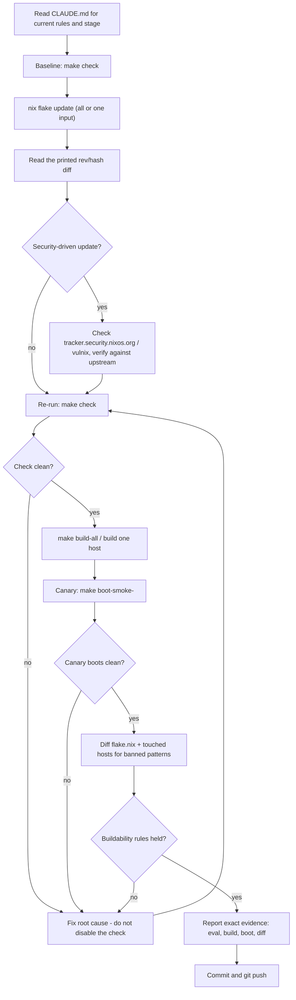

# Domain adapter: NixOS flake fleet management

Applies when the deliverable is a flake input bump, a security patch, or a
"bring the fleet up to date" pass across the `nixosConfigurations` in this
repo. The loop is unchanged; these definitions replace the coding defaults.
This is a specialization of the fable-method devops adapter (canary rollout,
blast radius, config-drift denial) for Nix's own nouns: `flake.lock`,
binary-cache substitution, generations, and this repo's buildability rules
(CLAUDE.md: no custom kernels, no `hostPlatform.gcc.arch` tuning on the
untuned hosts, sops secrets read at activation). Generic script or module
logic (does this Nix expression do what it claims) stays with the coding
default; this adapter takes over once correctness depends on live host
state, the binary cache, or a change that reaches more than one host.

## Workflow (steps + flowchart)

1. **Read the governing doc first.** Open this repo's `CLAUDE.md` for the
   current buildability rules and bring-up stage before touching anything -
   they change which hosts are even in scope.
2. **Snapshot current state.** Run `make check` (eval-only) and note which
   hosts currently build/substitute cleanly. This is the "before" baseline;
   without it, a post-update failure can't be attributed.
3. **Update inputs deliberately, not blindly.** Run `nix flake update` (or
   pin a single input: `nix flake update nixpkgs`). Read the diff Nix prints
   (old rev/hash -> new rev/hash per input), not just the fact that the
   command exited 0.
4. **Triage for security relevance.** If the update was prompted by a CVE or
   advisory, check the Nixpkgs security tracker
   (tracker.security.nixos.org) or run a scanner (e.g. `vulnix --system`)
   against the built closure, then verify the flagged package's actual
   version against upstream - CVE-to-package matching in this ecosystem has
   a known false-positive rate.
5. **Re-run eval and build.** `make check` again, then `make build-all` (or
   the specific host's `nixos-rebuild build-vm` / `nixos-rebuild build`).
   A green `nix flake update` proves nothing by itself.
6. **Canary before fleet-wide.** Boot-test one host first -
   `make boot-smoke-<host>` or `make test-<host>` - before treating the
   update as fleet-ready. `amalthea` is the canonical template; siblings
   differ only in host-specific fields.
7. **Check the buildability rules held.** Diff `flake.nix` and the touched
   `hosts/*/configuration.nix` for anything the update tempted in as a
   workaround: a custom kernel package, a `hostPlatform.gcc.arch` /
   `jupiter.build.microarch` addition on a host that isn't the dedicated
   tuned build path, or a substituter/cache change. Any of these silently
   breaks "everything builds from cache.nixos.org."
8. **Report with evidence, then push.** State exactly which checks ran and
   what they showed (eval clean, build succeeded, VM reached multi-user, no
   rule violated) before calling the fleet "updated." Commit and
   `git push` per this repo's convention once verified, not before.

## Minimum evidence set (binding, before calling any update "done")

1. **This repo's CLAUDE.md buildability rules and current bring-up stage**:
   which hosts are live vs. registered-but-not-installed, and which rules
   (no custom kernel, no microarch tuning outside the dedicated tuned path)
   currently apply. If a rule seems to have changed, say so before acting.
2. **The actual `nix flake update` diff and a fresh `make check` /
   `make build-all` run**: the repo's `flake.lock` and Nix files are a claim
   about what should build, not proof that it does.
3. **One live external reference for anything security-driven**: the
   Nixpkgs security tracker or an upstream release note, fetched now, not
   recalled - CVE-to-package matching drifts and produces false positives.

## Evidence and primary sources

A clean, current `make check` / `make build-all` / canary-boot output is the
primary evidence that an update is safe; `flake.lock` and `flake.nix` are
claims about intended state, not proof of a working closure. The sector's
signature non-evidence: `nix flake update` exiting 0, or a green CI badge,
proves the lock file changed, not that anything still builds or boots -
only a re-run eval/build/boot check is evidence of that.

## Authority order

Explicit user instruction > this repo's CLAUDE.md buildability rules and
bring-up stage > the platform's current observed build/boot behavior >
`flake.lock`'s stated intent > your own judgment that "this should be
fine." The sector's classic conflict: a flake input bump makes a host build
only by breaking a buildability rule (e.g. adding microarch tuning to force
a package to compile); the observed build result does not override the
rule - the fix targets the actual incompatibility, or the host stays
un-updated with the reason stated.

## Verification by observation

- The update is confirmed via a fresh `make check` and, for touched hosts,
  an actual build or boot (`make build-all`, `make boot-smoke-<host>`),
  never inferred from `nix flake update` or `git push` exiting cleanly.
- At least one host was canary-tested before the update is called
  fleet-ready; blast radius (which hosts are affected) is named explicitly.
- `flake.nix` and every touched `hosts/*/configuration.nix` were diffed for
  buildability-rule violations introduced as a shortcut, not assumed clean
  because the build passed.
- Any security-triggered update names the actual CVE/advisory and the
  package's real affected-version range, checked against upstream, not just
  a scanner's raw match.
- Any fleet-wide or irreversible step (pushing an update to all hosts, a
  production credential rotation) follows the method's authorization gate:
  no quoted user authorization, no action.

## Fraud table (for fable-judge)

| Fraud | Symptom |
|---|---|
| Claimed-clean update | "fleet updated to latest" reported with no fresh `make check`/build/boot output shown, or output predating the lock-file change |
| Blind input bump | `nix flake update` run and pushed without reading which inputs changed or what broke |
| Rule-breaking workaround | a build failure post-update "fixed" by adding a custom kernel, `hostPlatform.gcc.arch`, or `jupiter.build.microarch` outside the dedicated tuned path |
| Big-bang rollout | an update pushed to all hosts with no canary boot test on any single host first |
| Scanner-as-verdict | a CVE flagged by a scanner (e.g. vulnix) reported as fact without checking the package's actual version against upstream |
| Silenced check | `nix flake check` narrowed, skipped, or run with flags that mask the actual failure instead of fixing the root cause |
| Secret at build time | a sops-managed secret read or required at `nix build`/eval time instead of activation, breaking the "CI works without the age key" invariant |

## Done, by example

"The fleet is updated" means: `flake.lock`'s diff was read, `make check`
passed fresh, at least one host was built and canary-boot-tested,
`flake.nix`/touched host configs were checked against the buildability
rules, and the result was pushed per this repo's git convention - each of
these named with its actual output. Not: "ran `nix flake update`, looks
good."

## Sources

- NixOS Manual, "Changing the Configuration" (`nixos-rebuild switch` /
  `boot` / `test` / `build-vm`, generations, `--rollback`):
  https://nixos.org/manual/nixos/stable/#sec-changing-config (accessed
  2026-07-20)
- Nix Reference Manual, `nix flake update` (default updates all inputs;
  single-input update syntax; `nix flake lock` as the non-destructive
  variant): https://nix.dev/manual/nix/2.24/command-ref/new-cli/nix3-flake-update
  (accessed 2026-07-20)
- Nix Reference Manual, `nix.conf` substituters / `trusted-public-keys`
  (how a store object is accepted from `cache.nixos.org` vs. built
  locally): https://nix.dev/manual/nix/stable/command-ref/conf-file.html
  (accessed 2026-07-20)
- Nixpkgs security tracker (CVE-to-package linkage, untriaged/accepted/
  published workflow, the source for security-driven updates):
  https://tracker.security.nixos.org/ (accessed 2026-07-20)
- NixOS Discourse, "Checking and dealing with CVEs" (practical triage:
  `vulnix --system`, `nix why-depends`, known false-positive rate of
  CVE-to-package matching): https://discourse.nixos.org/t/checking-and-dealing-with-cves/48224
  (accessed 2026-07-20)
