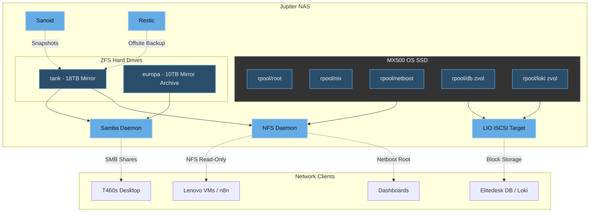

# Jupiter OS - Deep Dive Architecture

This document outlines the advanced architectural patterns implemented in the Jupiter OS monorepo. It details the precise mechanisms behind the impermanent filesystems, the network storage layers, the anonymized DNS pipeline, and the diskless netboot systems.

## 1. Impermanence: "Erase Your Darlings"

Jupiter OS uses the `impermanence` module (`modules/core/impermanence.nix`) to achieve an ephemeral root filesystem. By default, anything not explicitly configured to persist will be destroyed upon reboot.

### Mechanism
* **ZFS Snapshots:** On boot, the ZFS `root` dataset is rolled back to a blank state.
* **Persistent Mapping:** The Nix module binds critical directories (`/var/log`, `/var/lib/nixos`, `/var/lib/sops-nix`) and files (`/etc/machine-id`, `/etc/ssh/ssh_host_ed25519_key`) from a persistent store (usually `/persist`) into the ephemeral root via bind mounts.
* **Why?** This enforces absolute declarative purity. If a piece of software writes a file outside of the defined persistent boundaries or the Nix store, it ceases to exist on the next boot, eliminating configuration drift and state rot.

## 2. Storage Architecture: Disko & ZFS

The Jupiter NAS handles storage meticulously using a combination of fast solid-state drives and high-capacity magnetic drives.

### Key Components:
1. **OS Disk (Disko):** The 500GB SSD is fully managed by Nix via `disko`. It configures a single-disk `rpool` optimized for fast random I/O. It stores the Nix store, fast `netboot` NFS roots, and ZFS volumes (`zvols`) for databases.
2. **Data Pools (`tank` & `europa`):** These pools are *not* managed by Disko because they contain irreplaceable data. They are built manually and imported at boot (`boot.zfs.extraPools`). `tank` is heavily snapshotted via `sanoid` and backed up to Backblaze B2 using `restic`. `europa` is a frozen, read-only legacy archive.

## 3. Network iSCSI & PXE Diskless Boot

The `Elitedesk` compute node has no physical storage. It relies entirely on the network to boot and operate.

### The Boot Pipeline
1. **DHCP & PXE (Lenovo):** The Lenovo host runs `pixiecore` (an all-in-one DHCP proxy and iPXE server). When the Elitedesk boots, Pixiecore intercepts the PXE request and points the machine to an NGINX server hosting the NixOS kernel (`bzImage`) and `initrd`.
2. **Copy To RAM:** The kernel parameters include `copytoram`, meaning the entire initial operating system image is loaded into the Elitedesk's physical memory.
3. **iSCSI Attachment (Elitedesk -> NAS):** During the boot sequence, `openiscsi` automatically discovers the NAS (`nas.home.jupiter.au:3260`) and logs into its specific Target IQN (`iqn.2026-06.au.jupiter:elitedesk`).
4. **Block Device Mapping:** The NAS (running the LIO target) maps the fast SSD zvols (`/dev/zvol/rpool/db` and `rpool/loki`) to the Elitedesk. To the Elitedesk, these appear as local `/dev/sdX` drives.
5. **Operation:** Databases and metrics (Loki) are run from RAM on the Elitedesk, but all writes are pushed synchronously over the network to the NAS's SSD block devices, ensuring speed and data integrity without the need for physical disks on the compute node.

## 4. Anonymized Split-Horizon DNS

The `modules/services/dns.nix` file describes a highly sophisticated DNS routing pipeline.

1. **Unbound (Front Resolver):** Unbound serves as the authoritative resolver for the internal `home.jupiter.au` zone, allowing machines to find each other locally (e.g., `nas.home.jupiter.au` -> `10.1.1.2`).
2. **DNSCrypt-Proxy (Upstream):** Instead of Unbound querying root servers in cleartext, all external queries are forwarded to `dnscrypt-proxy`.
3. **Anonymized Routing:** DNSCrypt uses Anonymized DNS. It routes queries through a "relay" to a distinct "resolver". The relay sees the user's IP address but not the query; the resolver sees the query but not the IP address. This prevents ISPs or DNS providers from profiling the network's browsing habits.
