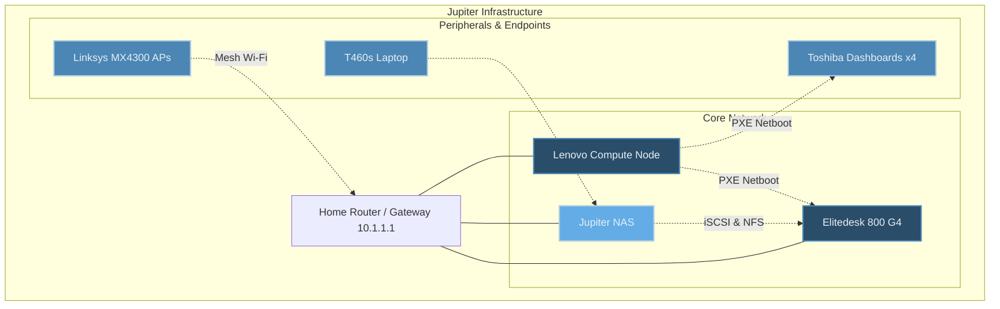

# Jupiter OS - NixOS Monorepo

Welcome to **Jupiter OS**, a declarative, fully reproducible NixOS monorepo driving the Jupiter infrastructure.

## The "ELI5" Analogy
Imagine building a house from scratch using LEGO blocks. Normally, you build it block-by-block, and if a wall breaks or you want to move the house to another city, you have to tear it down and rebuild it manually, hoping you remember how.

**Jupiter OS** is like having an indestructible master blueprint for your LEGO house. It explicitly defines every single brick, wire, and pipe in the infrastructure. With a single command, you can deploy the exact same house—complete with network configurations, secure storage, and services—anywhere in the world. And if a house burns down? You simply print a new one.

At its core, this repository orchestrates a bare-metal compute node, an enterprise-grade ZFS storage array (NAS), a personal workstation, touchscreen dashboard kiosks, and a diskless netbooted node. All configurations, secrets, and firmware are managed declaratively using **Nix Flakes**.

## Architecture & Topology

The Jupiter infrastructure operates a split-compute-and-storage architecture.



### The Fleet
* **Lenovo (Compute Node):** The "Brain". Bare-metal NixOS hosting the core DNS resolver, `n8n`, a Home Assistant VM, and the PXE boot server.
* **Jupiter NAS:** The "Vault". A ZFS-backed storage array exporting NFS, SMB, and iSCSI block storage. It uses an enterprise-grade mirror layout (`tank`) and a frozen archive (`europa`).
* **Elitedesk 800 G4 (Diskless Node):** The "Muscle". Boots directly from the Lenovo's PXE server into RAM (`copytoram`), mounting its persistent storage (DB, Loki) via iSCSI from the NAS.
* **Dashboards:** 4x Wayland Kiosks booting over PXE, running Chromium to display Home Assistant.
* **T460s Laptop:** Personal workstation running the Noctalia-inspired `niri` Wayland compositor.

## Flake Anatomy & Directory Structure

This monorepo leverages standard Nix flake architecture.

| Directory / File | Description |
|------------------|-------------|
| `flake.nix` | The entry point. Defines all inputs (nixpkgs, sops-nix, disko) and outputs (nixosConfigurations, packages, devShells). |
| `hosts/` | Machine-specific configurations. Each host has its own `configuration.nix` (and sometimes `disko.nix`) tying together the hardware and modular features. |
| `modules/` | Reusable, composable configuration blocks (e.g., `zfs-nas.nix`, `impermanence.nix`, `n8n.nix`, `iscsi.nix`). Hosts import these modules to build their environment. |
| `secrets/` | Encrypted secrets (passwords, tokens, cloudflare certs) managed via `sops-nix` and `age`. |
| `terraform/` | Declarative infrastructure-as-code for external services (e.g., UniFi Wi-Fi networks). |
| `Makefile` | Helpful wrappers for building, testing VMs, and running flake checks. |

## Inputs & Outputs

The `flake.nix` exposes specific derivations and configurations:

| Input Source | Purpose |
|--------------|---------|
| `nixpkgs` | The core package repository (`nixos-unstable`). |
| `sops-nix` | Agnostic secret management (using Age keys). |
| `deploy-rs` | Remote deployment automation. |
| `nix-openwrt-imagebuilder` | Declarative generation of custom OpenWrt firmware. |
| `disko` | Declarative disk partitioning and formatting. |
| `impermanence` | "Erase your darlings" functionality (ephemeral root filesystems). |

### Exposed Flake Outputs
* `nixosConfigurations.lenovo`
* `nixosConfigurations.nas`
* `nixosConfigurations.elitedesk`
* `nixosConfigurations.t460s`
* `nixosConfigurations.dashboards`
* `packages.x86_64-linux.mx4300-firmware`
* `devShells.x86_64-linux.default`

## Getting Started & Usage

### 1. Development Shell
Enter the development environment (which provides `terraform`, `sops`, `age`, and `deploy-rs`):
```bash
nix develop
```

### 2. Local Builds and VM Testing
You can compile systems locally to verify evaluations:
```bash
make build-all
```

To build and launch a specific host in a QEMU virtual machine (perfect for testing configuration changes safely):
```bash
make test-lenovo
```

### 3. Remote Deployment
Deploy the configuration directly to a running node using `deploy-rs`:
```bash
# Deploys to the Lenovo node
deploy .#lenovo
```

### 4. Updating the Flake
Update all `flake.lock` dependencies to their latest versions:
```bash
make update
```

## Deep Dive Architecture
For an exhaustive, technical deep dive into the ZFS Storage architecture, the Diskless Netboot sequence, and the Impermanence configurations, please refer to [ARCHITECTURE.md](ARCHITECTURE.md).
