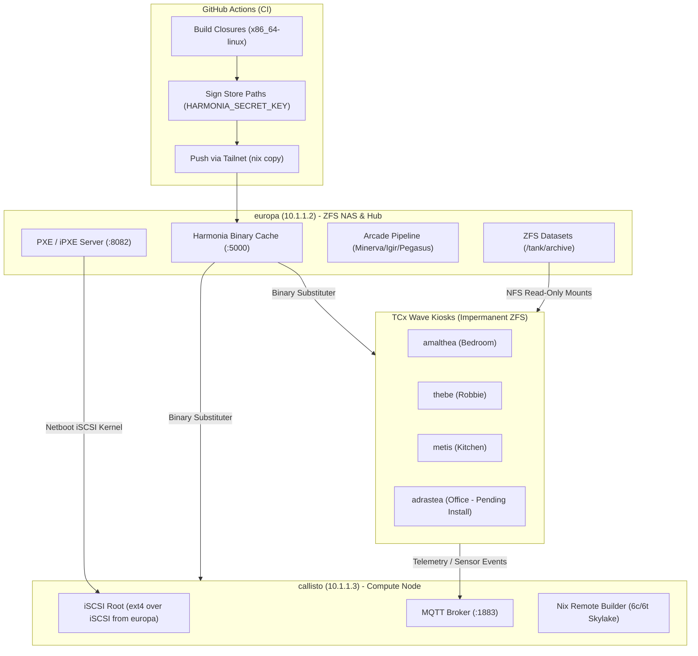

# DEEPSEEK HARNESS PROMPT REPORT: PR #75 ANALYSIS & NEXT PR ACTION PLAN

This document contains a comprehensive analysis of **Pull Request #75 (`cddd5ad`)** and the **Jupiter OS** repository, formatted as a standalone, structured **NEW PROMPT FOR THE DEEPSEEK HARNESS** to investigate and action all findings for the next PR.

***

# AGENT INSTRUCTION & TASK PROMPT FOR DEEPSEEK HARNESS

## ROLE & SYSTEM CONTEXT
You are Jules, an elite Systems Engineer and NixOS Maintainer working on **Jupiter OS** (`jupiter-os`).
Jupiter OS is a declarative, ZFS-backed NixOS monorepo managing a 7-host fleet (NAS, compute nodes, and touch-screen arcade kiosks) for home and lab infrastructure.

Your objective is to ingest this comprehensive review of **Pull Request #75 (`cddd5ad`)**, investigate the remaining architectural and operational defects in `jupiterOS`, and **action all findings by implementing the NEXT PR**.

---

## SECTION 1: FULL ANALYSIS OF PULL REQUEST #75 (`cddd5ad`)

### 1. Executive Summary
PR #75 (**"fleet audit remediation: security, slop removal, dedup, modularization"**) is a massive refactoring commit touching **178 files** (`+44,516 / -1,828` lines across the codebase). It systematically remediates critical P0 security vulnerabilities, removes hallucinated/dead configuration code ("AI slop"), unifies scattered data structures into single-source-of-truth assets, and standardizes NixOS module abstractions across all 7 fleet hosts.

### 2. Detailed Breakdown of Changes in PR #75

#### A. Security Remediations (P0)
1. **Unsigned Nix Cache Store Imports (`modules/core/ci-cache-receiver.nix`)**:
   - *Problem*: Configured `nix.settings.require-sigs = false`, accepting unsigned store paths imported over the tailnet.
   - *Remediation*: Dropped `require-sigs = false`. Integrated `nix store sign` into `scripts/ci/post-build-hook.sh` using `HARMONIA_SECRET_KEY` so all binary cache closures served by Harmonia (`:5000`) are cryptographically signed.
2. **Exposed Chrome Remote Debugging (`modules/desktop/dashboard-kiosk.nix`)**:
   - *Problem*: Launched Chromium with `--remote-debugging-port=9222` and `--remote-allow-origins=*`, exposing Chrome DevTools Protocol unauthenticated to the LAN.
   - *Remediation*: Removed CDP debugging flags and obsolete Chromium command-line switches.
3. **PCI Compliance Leak in POS Peripheral (`modules/services/customer-msr.nix`)**:
   - *Problem*: Raw credit card Primary Account Numbers (PANs) read from magnetic stripe readers were logged to `stderr` and published over unencrypted MQTT topics.
   - *Remediation*: Masked PAN payloads before emitting logs or MQTT messages.
4. **Unrestricted Service Binding (`modules/services/aeon.nix`)**:
   - *Problem*: Bound service listener to `0.0.0.0`.
   - *Remediation*: Bound explicitly to `127.0.0.1` by default; routed via `cloudflared` tunnel on Callisto.
5. **Permissive Sysfs Permissions (`modules/services/ha-agent.nix`)**:
   - *Problem*: Applied `chmod 0666` to kernel sysfs nodes.
   - *Remediation*: Restricted permissions to `0664`.

#### B. AI-Slop & Dead Code Elimination
1. **Hallucinated Kernel & Mesa Attributes (`modules/gaming/console.nix`)**:
   - Removed hallucinated options `cachyOsKernel`, `mesaGit`, and non-existent `linuxPackages_cachyos`.
2. **Dead Tombstone Configs (`modules/storage/zfs-nas.nix`, `zfs-tuning.nix`)**:
   - Removed ~50 lines of commented-out legacy Samba configuration; gated Samba tuning options on `services.samba.enable`.
3. **Fabricated Systemd Unit Dependencies (`modules/services/suno-backup.nix`)**:
   - Removed `after = [ "sops-nix.service" ]` (sops-nix operates in NixOS preactivation, not as a runtime systemd service).
4. **Flake & Build Cleanup (`flake.nix`)**:
   - Deduplicated `aeon-cli` package alias, removed duplicated module imports, replaced non-reproducible `date`/`git rev-parse` in documentation builds with `self.rev`, and migrated deprecated `nixfmt-rfc-style` to `nixfmt`.
   - Removed dead/orphaned modules: `dev-machine.nix`, `wireguard.nix`, `dmt-console.nix`, `vps-image-server.nix`.

#### C. Single Source of Truth & Modularization
1. **Canonical Arcade Systems Catalogue (`scripts/cartridge-catalogue.tsv`)**:
   - Created a single TSV table (19 systems, 8 metadata columns) and parser (`modules/services/arcade-catalogue.nix`). Replaced 4 divergent hand-maintained lists across `cartridges.nix`, `rom-acquire.nix`, `rom-scraper.nix`, and `arcade-inventory.nix`.
2. **Centralized Fleet Addressing (`modules/network/fleet.nix`)**:
   - Defined `jupiter.fleet.addresses` and `lanCidr` options, replacing scattered `10.1.1.*` IP string literals across modules.
3. **Shared Helper Library (`modules/lib.nix`)**:
   - Standardized `mkSessionLauncher`, `commonServiceHardening`, `polkitUnitRule`, `nfsRoMountOptions`, and `tcxwaveMqttPy`.
4. **Reusable Build Machines Module (`modules/core/build-machines.nix`)**:
   - Refactored Europa's inline remote build configuration into `jupiter.core.buildMachines`.

---

### 3. Architecture & Fleet Topology (Mermaid Diagram)



---

### 4. ELI5 Analogy (Explain Like I'm 5)

> Imagine your home is a smart amusement park with 7 computers running different rides and ticket booths. Before PR #75, each ride had its own instruction manual written by different workers—some manuals listed wrong Wi-Fi passwords, some left backdoors unlocked, and four different manuals gave conflicting rules for how arcade games were loaded!
>
> **PR #75 was like a master supervisor coming in with a label maker and a master binder:**
> 1. They locked all open backdoors and put secret keys on all incoming delivery trucks (Security).
> 2. They threw away non-existent instructions and fake parts list (Slop Cleanup).
> 3. They put one master catalogue board in the main office that all game booths read from (Single Source of Truth).
> 4. Now the amusement park runs smoothly, securely, and predictably!

---

## SECTION 2: PROBLEMS IN JUPITEROS & SCOPE FOR THE NEXT PR

While PR #75 eliminated significant debt, **critical operational problems, configuration risks, and incomplete migrations remain in Jupiter OS**. You are tasked with investigating and fixing all of the following in the NEXT PR:

### 1. [P0 - ZFS Storage Risk] Europa Live ZFS Host Using Placeholder `hostId` ("deadbeef")
- **Location**: `hosts/europa/configuration.nix:48` (`networking.hostId = "deadbeef";`)
- **Problem**: Europa is the primary production ZFS NAS holding multi-TB storage pools (`tank`). Setting `networking.hostId` to `deadbeef` (a generic placeholder) violates OpenZFS safety guarantees. If host IDs collide or reset, pool imports can fail or require forced imports (`zpool import -f`), risking pool locking or corrupt state during emergency boots.
- **Action**:
  1. Generate a deterministic, host-unique 32-bit hex hostId for Europa (derived from system serial or `/etc/machine-id` digest).
  2. Document the hostId in `hosts/europa/configuration.nix` and `docs/host-bringup-history.md`.

### 2. [P0 - Fleet Safety] Adrastea Unprotected Disko Device Placeholder (`REPLACE-ME`)
- **Location**: `hosts/adrastea/configuration.nix:21` (`disk = "/dev/disk/by-id/REPLACE-ME-adrastea-os-disk";`)
- **Problem**: Adrastea is registered and enabled in flake check (`nix flake check`). `modules/storage/zfs-profiles.nix` handles `REPLACE-ME` with a warning, but if `nixos-anywhere` or disko is accidentally executed against `adrastea` before setting the real disk ID, disko will throw a runtime error or attempt to wipe an unintended device.
- **Action**:
  1. Add an explicit assertion in `modules/storage/zfs-profiles.nix` that blocks disko formatting commands (`diskoScript`) if `cfg.disk` contains `REPLACE-ME`.
  2. Ensure `make check` (`nix flake check --no-build`) continues to evaluate cleanly without triggering build-time assertions.

### 3. [P1 - Architectural Migration] Custom Systemd Tailscale/Headscale Wrappers vs Native nixpkgs Services
- **Location**: `modules/services/tailscale.nix` & `modules/services/headscale.nix`
- **Problem**: Both modules contain `# TODO(upstream-port decision)` notes. They construct manual systemd services wrapping `tailscaled` and `headscale` binaries rather than leveraging native `services.tailscale` and `services.headscale` options provided by nixpkgs.
- **Action**:
  1. Evaluate migrating `jupiter.services.tailscale` and `jupiter.services.headscale` to wrap standard nixpkgs `services.tailscale` / `services.headscale` where possible.
  2. Ensure socket paths, state directories (`cfg.stateDir`), and port forwarding (`41641` for tailscale, `3478`/`8080` for headscale) remain fully backwards-compatible for live deployments on Europa and Callisto.

### 4. [P1 - CI Security] Harmonia Signing Key Environment Enforcement (#63)
- **Location**: `scripts/ci/post-build-hook.sh` & `.github/workflows/ci-distributed*.yml`
- **Problem**: CI workflows stage `HARMONIA_SECRET_KEY` for binary signing. If the secret is not set in GitHub repository secrets, `nix store sign` in the post-build hook outputs a warning or fails silently during main-branch pushes, leading to unsigned paths reaching Harmonia.
- **Action**:
  1. In `scripts/ci/post-build-hook.sh`, check for `HARMONIA_SECRET_KEY` existence explicitly and log a clear warning or non-zero exit when running in CI environments.
  2. Verify that `nix store sign` uses `--key-file` safely without echoing private key material to stdout/stderr.

### 5. [P1 - Operations] PXE Netboot Asset Dependency Guard (`boot.ipxe`)
- **Location**: `hosts/europa/configuration.nix` & `hosts/callisto/configuration.nix`
- **Problem**: `jupiter-pxe-assets.service` on Europa publishes `/var/lib/pxe-netboot/current/boot.ipxe` pointing to Callisto's system closure on Europa's storage. If Callisto has not been built or its nix store path does not exist on Europa, Callisto netboot fails at the iPXE stage.
- **Action**:
  1. Add a pre-start check script to `jupiter-pxe-assets.service` that validates the target Callisto closure path exists before updating the `current` symlink.

### 6. [P2 - Repository Hygiene] Syntax Error in Deprecated Script & Formatter Cleanup
- **Location**: `scripts/deprecated/extract-launchbox-metadata.sh:44` & `flake.nix:587`
- **Problem**:
  - `extract-launchbox-metadata.sh` has a bash syntax error (`unexpected token '2'`).
  - `flake.nix` and `Makefile` still reference `nixfmt-rfc-style` in comments/docs despite the tool being renamed to `nixfmt` in nixpkgs.
- **Action**:
  1. Fix line 44 in `scripts/deprecated/extract-launchbox-metadata.sh` so `bash -n scripts/deprecated/extract-launchbox-metadata.sh` passes cleanly.
  2. Update documentation and Makefile references from `nixfmt-rfc-style` to `nixfmt`.

---

## SECTION 3: STEP-BY-STEP ACTION PLAN FOR DEEPSEEK HARNESS

Execute the following steps sequentially to research, implement, and verify the NEXT PR:

### Step 1: Investigation & Baseline Verification
1. Run `make check` (`nix flake check --no-build`) to confirm the baseline repository state evaluates green.
2. Run syntax checks across all shell scripts:
   ```bash
   for f in $(find scripts -name "*.sh"); do bash -n "$f" || echo "Error in $f"; done
   ```
3. Run syntax checks across python scripts:
   ```bash
   for f in $(find scripts -name "*.py"); do python3 -m py_compile "$f"; done
   ```

### Step 2: Implementation
1. **Fix Europa `hostId`**:
   - Update `hosts/europa/configuration.nix` with a valid, non-placeholder hostId (e.g. `c1a02e10` or derived value). Update documentation references.
2. **Harden Adrastea Disko Guard**:
   - In `modules/storage/zfs-profiles.nix`, ensure `diskoScript` checks for `REPLACE-ME` before running destructive commands.
3. **Harmonia CI Signing Script Guard**:
   - Update `scripts/ci/post-build-hook.sh` to validate `HARMONIA_SECRET_KEY` availability before attempting `nix store sign`.
4. **Fix Deprecated Script Syntax**:
   - Fix syntax error in `scripts/deprecated/extract-launchbox-metadata.sh`.
5. **Update Formatter References**:
   - Ensure `Makefile`, `README.md`, `CLAUDE.md`, and `flake.nix` consistently reference `nixfmt`.

### Step 3: Verification & Pre-Commit
1. Re-run `make check` to ensure all 7 host configurations evaluate cleanly.
2. Verify all shell and python scripts pass syntax compilation.
3. Run `make fmt` (or `nixfmt`) to ensure code formatting complies with repository conventions.
4. Execute `git status` and `git diff` to review all changes.

### Step 4: Submission
1. Commit changes with a descriptive commit message following the project standard:
   - Short summary (<= 50 chars).
   - Detailed body explaining the issue addressed, why changes were made, and verification steps performed.
2. Submit the PR/branch.

---
**END OF NEW PROMPT FOR DEEPSEEK HARNESS**
